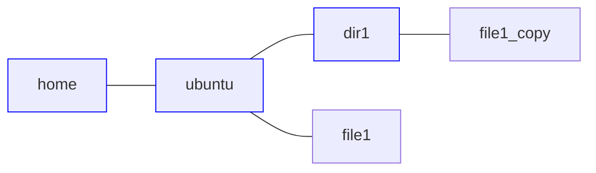

### ls  
ディレクトリの中に存在するファイルやディレクトリを表示するコマンドです。
#### オプション
lsコマンドのオプションです。
```bash
$ ls -la
```
などのように、複数のオプションを同時に使うこともできます。  
-laの場合は、隠しファイルなども含めて、ファイルやディレクトリの詳細を表示するということになります。
+ -a 隠しファイルなども全て表示
+ -l 最終更新時間などの詳細も表示
+ -t 最終更新時間の新しい順に表示
+ -r 逆順に表示
+ -1 縦に並べて表示
+ -x 横に並べて表示
+ -S ファイルサイズ順に表示
+ -X 拡張子順に表示
+ -R ディレクトリの中身も表示
### pwd  
現在いるディレクトリを表示するコマンドです。
```bash
$ pwd
/home/ubuntu
```
### cd  
指定したディレクトリへ移動するコマンドです。
```bash
$ cd dir1
```
### mkdir  
ディレクトリを作成するコマンドです。
```bash
$ mkdir dir1
$ ls
dir1
```
### rmdir  
ディレクトリを削除するコマンドです。
```bash
$ ls
dir1
$ rmdir dir1
$ ls

```
### touch  
ファイルを作成するコマンドです。
```bash
$ touch file
$ ls
file
```
### rm  
ファイルを削除するコマンドです。ディレクトリを削除することもできます。
```bash
$ ls
file
$ rm file
$ ls

```
### cp  
ファイルやディレクトリをコピーするコマンドです。  
使用例の解説を書こうと思ったらめっちゃ長くなりました。
1. pwdコマンドで現在のディレクトリを確認  
2. lsコマンドで現在のディレクトリに保存されているファイルやディレクトリの一覧を表示  
-Rオプションが付いているので、現在のディレクトリに保存されているディレクトリの中身も表示されますが、現在は中身がないので何も表示されていません。
3. catコマンドでfile1の中身を表示  
4. file1をdir1の中に「file1_copy」というファイル名でコピー  
5. 再びlsコマンドでファイルやディレクトリの一覧を表示  
6. dir1の中に「file1_copy」があることを確認  
7. catコマンドでdir1/file1_copyの中身がfile1と同じ「Hello World!」であることを確認 
```bash
$ pwd
/home/ubuntu

$ ls -R
dir1 file1

./dir1:

$ cat file1
Hello World!

$ cp file1 dir1/file1_copy

$ ls -R
dir1 file1

./dir1:
file1_copy

$ cat dir1/file1_copy
Hello World!
```
グラフで表すとこのようになります。  青で囲んだものはディレクトリです。

### mv
ファイルやディレクトリを移動するコマンドです。

