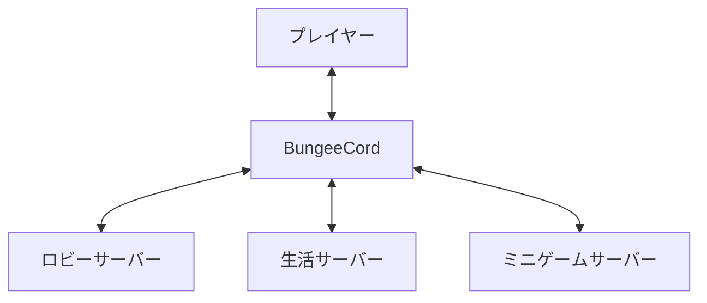

## サーバーソフトの種類
Minecraftのサーバーソフトには様々な種類があります。そのため、それぞれの違いについて最初に解説します。

### 公式サーバー
公式が配布しているサーバーソフトです。バニラサーバーとも呼ばれます。

他のものと比べると機能が少ないため、難易度は一番低いです。初めての方はこれを使用してみると良いと思います。

### Spigot
有志が開発しているサーバーソフトです。

プラグインが使用出来るため、自由度が高いです。  
プラグインを使用することで、建物の保護が出来たり（[WorldGuard](https://dev.bukkit.org/projects/worldguard)）、Discordとサーバー内のチャットを繋げることが出来るようになります（[DiscordSRV](https://www.spigotmc.org/resources/discordsrv.18494/)）。

### Paper
Spigotを改良したサーバーソフトです。

「Spigotに比べて高速」と公式は謳っています。Spigotと互換性があるため、Spigotのプラグインが使用出来ます。

### BungeeCord
サーバーとサーバーを繋げるためのソフトです。

図に表すとこのようになります。
プレイヤーはBungeeCordを経由して、複数のサーバーを行き来することが出来ます。

## 参考にしたサイト
[PaperMC - The High Performance Fork](https://papermc.io/)